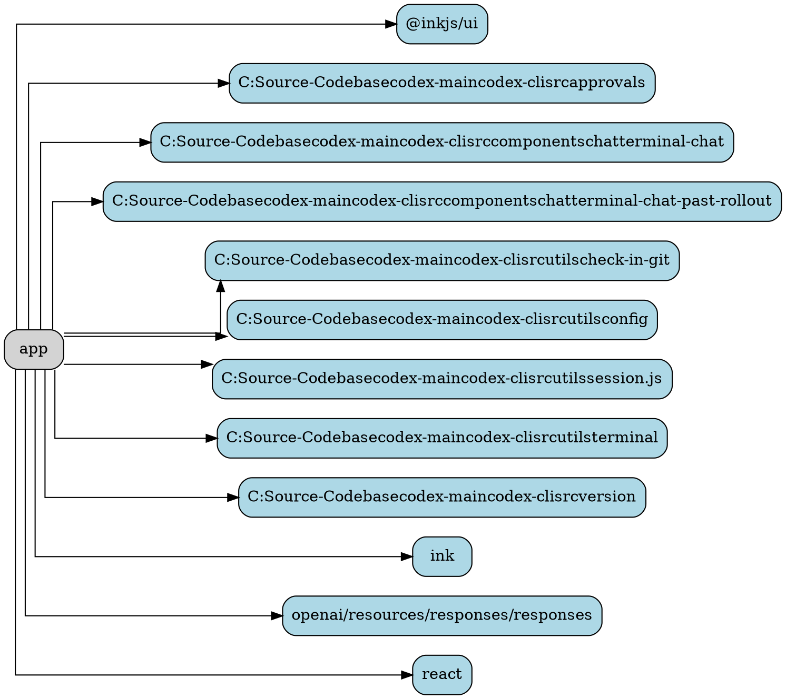

# Ability Card: App

**Project:** `codex-cli`

**Description:**
(A brief, one-sentence description of the ability's primary function, to be filled in manually).

---

## Entry Points

*   `app.tsx`

---

## Components

### Code Summary

# Analysis for `codex-main/codex-cli/src/app.tsx`

## Top-Level Functions

### `def App({
  prompt,
  config,
  rollout,
  imagePaths,
  approvalPolicy,
  additionalWritableRoots,
  fullStdout,
}: Props)`

---

### Dependency Graph

---

## Best Practices & Observations

*   (To be filled in manually)

---

## Potential for AIPass-Echosystem

*   (To be filled in manually)

