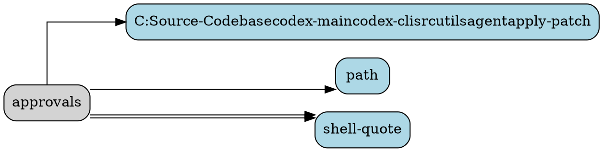

# Ability Card: Approvals

**Project:** `codex-cli`

**Description:**
(A brief, one-sentence description of the ability's primary function, to be filled in manually).

---

## Entry Points

*   `approvals.ts`

---

## Components

### Code Summary

# Analysis for `codex-main/codex-cli/src/approvals.ts`

## Top-Level Functions

### `def canAutoApprove(command: ReadonlyArray<string>, workdir: string | undefined, policy: ApprovalPolicy, writableRoots: ReadonlyArray<string>, env: NodeJS.ProcessEnv = process.env)`

**Docstring:**
```
* Tries to assess whether a command is safe to run, though may defer to the
 * user for approval.
 *
 * Note `env` must be the same `env` that will be used to spawn the process.
```


---

### `def canAutoApproveApplyPatch(applyPatchArg: string, workdir: string | undefined, writableRoots: ReadonlyArray<string>, policy: ApprovalPolicy)`


---

### `def isWritePatchConstrainedToWritablePaths(applyPatchArg: string, workdir: string | undefined, writableRoots: ReadonlyArray<string>)`

**Docstring:**
```
* All items in `writablePaths` must be absolute paths.
```


---

### `def allPathsConstrainedTowritablePaths(candidatePaths: ReadonlyArray<string>, workdir: string | undefined, writableRoots: ReadonlyArray<string>)`


---

### `def isPathConstrainedTowritablePaths(candidatePath: string, workdir: string | undefined, writableRoots: ReadonlyArray<string>)`

**Docstring:**
```
If candidatePath is relative, it will be resolved against cwd.
```


---

### `def resolvePathAgainstWorkdir(candidatePath: string, workdir: string | undefined)`

**Docstring:**
```
* If not already an absolute path, resolves `candidatePath` against `workdir`
 * if specified; otherwise, against `process.cwd()`.
```


---

### `def pathContains(parent: string, child: string)`

**Docstring:**
```
Both `parent` and `child` must be absolute paths.
```


---

### `def tryParseApplyPatch(bashArg: string)`

**Docstring:**
```
* `bashArg` might be something like "apply_patch << 'EOF' *** Begin...".
 * If this function returns a string, then it is the content the arg to
 * apply_patch with the heredoc removed.
```


---

### `def isSafeCommand(command: ReadonlyArray<string>)`

**Docstring:**
```
* If this is a "known safe" command, returns the (reason, group); otherwise,
 * returns null.
```


---

### `def isValidSedNArg(arg: string | undefined)`


---

### `def isEntireShellExpressionSafe(parts: ReadonlyArray<ParseEntry>)`

**Docstring:**
```
* Determines whether a parsed shell expression consists solely of safe
 * commands (as per `isSafeCommand`) combined using only operators in
 * `SAFE_SHELL_OPERATORS`.
 *
 * If entirely safe, returns the reason/group from the *first* command
 * segment so callers can surface a meaningful description. Otherwise returns
 * null.
```


---

### `def isParseEntryWithOp(entry: ParseEntry)`

**Docstring:**
```
Runtime type guard that narrows a `ParseEntry` to the variants that
carry an `op` field. Using a dedicated function avoids the need for
inline type assertions and makes the narrowing reusable and explicit.
```


---


### Dependency Graph



---

## Best Practices & Observations

*   (To be filled in manually)

---

## Potential for AIPass-Echosystem

*   (To be filled in manually)

