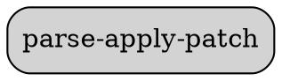

# Ability Card: Parse-Apply-Patch

**Project:** `codex-cli`

**Description:**
(A brief, one-sentence description of the ability's primary function, to be filled in manually).

---

## Entry Points

*   `parse-apply-patch.ts`

---

## Components

### Code Summary

# Analysis for `codex-main/codex-cli/src/parse-apply-patch.ts`

## Top-Level Functions

### `def parseApplyPatch(patch: string)`

**Docstring:**
```
* @returns null when the patch is invalid
```


---

### `def appendLine(content: string, line: string)`


---


### Dependency Graph



---

## Best Practices & Observations

*   (To be filled in manually)

---

## Potential for AIPass-Echosystem

*   (To be filled in manually)

