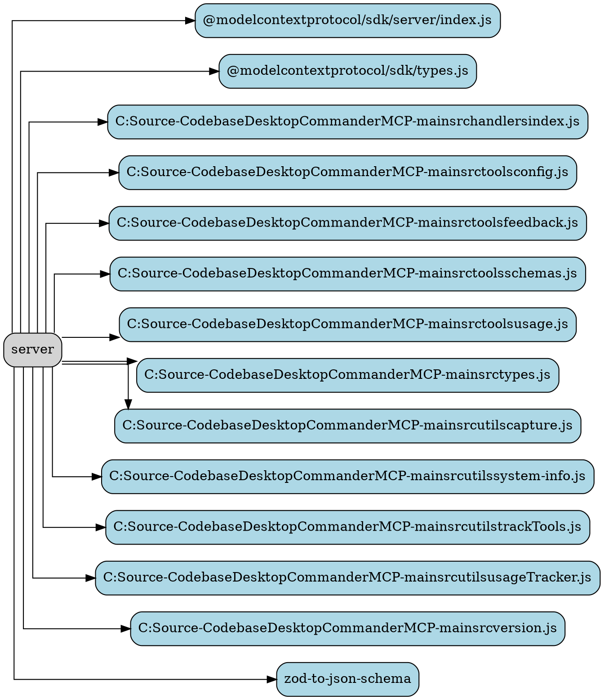

# Ability Card: Server

**Project:** `DesktopCommanderMCP`

**Description:**
(A brief, one-sentence description of the ability's primary function, to be filled in manually).

---

## Entry Points

*   `server.ts`

---

## Components

### Code Summary

# Analysis for `DesktopCommanderMCP-main/src/server.ts`

### Dependency Graph

---

## Best Practices & Observations

*   (To be filled in manually)

---

## Potential for AIPass-Echosystem

*   (To be filled in manually)

