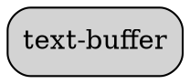

# Ability Card: Text-Buffer

**Project:** `codex-cli`

**Description:**
(A brief, one-sentence description of the ability's primary function, to be filled in manually).

---

## Entry Points

*   `text-buffer.ts`

---

## Components

### Code Summary

# Analysis for `codex-main/codex-cli/src/text-buffer.ts`

## Classes

### `class TextBuffer`

**Docstring:**
```
──────────────────────────────────────────────────────────────────────────
```

**Methods:**

- **`line(r: number)`**
  - *Docstring:* =======================================================================
- **`lineLen(r: number)`**
- **`ensureCursorInRange()`**
- **`setCursorIdx(idx: number)`**
  - *Docstring:* * Sets the cursor position based on a character offset from the start of the document.
- **`snapshot()`**
  - *Docstring:* =====================================================================
- **`pushUndo()`**
- **`restore(state: { lines: Array<string>; row: number; col: number } | undefined)`**
  - *Docstring:* * Restore a snapshot and return true if restoration happened.
- **`ensureCursorVisible(vp: Viewport)`**
  - *Docstring:* =======================================================================
- **`getVersion()`**
  - *Docstring:* =======================================================================
- **`getCursor()`**
- **`getVisibleLines(vp: Viewport)`**
- **`getText()`**
- **`getLines()`**
- **`undo()`**
  - *Docstring:* =====================================================================
- **`redo()`**
- **`insert(ch: string)`**
  - *Docstring:* =======================================================================
- **`newline()`**
- **`backspace()`**
- **`del()`**
- **`deleteToLineEnd()`**
  - *Docstring:* * Delete everything from the caret to the *end* of the current line. The
- **`deleteToLineStart()`**
  - *Docstring:* * Delete everything from the *start* of the current line up to (but not
- **`deleteWordLeft()`**
  - *Docstring:* ------------------------------------------------------------------
- **`deleteWordRight()`**
  - *Docstring:* Delete the word to the *right* of the caret, akin to many editors'
- **`move(dir: Direction)`**
- **`moveToStartOfDocument()`**
  - *Docstring:* ------------------------------------------------------------------
- **`moveToEndOfDocument()`**
  - *Docstring:* Move caret to *absolute* end of the buffer (last row, last column).
- **`insertStr(str: string)`**
  - *Docstring:* =====================================================================
- **`startSelection()`**
- **`endSelection()`**
- **`getSelectedText()`**
  - *Docstring:* Extract selected text. Returns null if no valid selection.
- **`copy()`**
- **`paste()`**
- **`handleInput(input: string | undefined, key: Record<string, boolean>, vp: Viewport)`**
  - *Docstring:* =======================================================================

---

## Top-Level Functions

### `def isWordChar(ch: string | undefined)`

**Docstring:**
```
Simple helper for word‑wise ops.
```


---

### `def clamp(v: number, min: number, max: number)`


---

### `def toCodePoints(str: string)`

**Docstring:**
```
* -------------------------------------------------------------------------
 *  Unicode‑aware helpers (work at the code‑point level rather than UTF‑16
 *  code units so that surrogate‑pair emoji count as one "column".)
 * ----------------------------------------------------------------------
```


---

### `def cpLen(str: string)`


---

### `def cpSlice(str: string, start: number, end?: number)`


---

### `def dbg(...args: Array<unknown>)`


---


### Dependency Graph



---

## Best Practices & Observations

*   (To be filled in manually)

---

## Potential for AIPass-Echosystem

*   (To be filled in manually)

