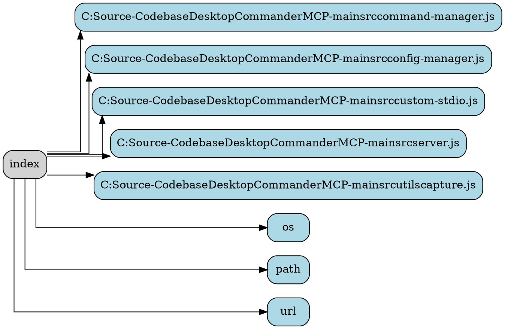

# Ability Card: Index

**Project:** `DesktopCommanderMCP`

**Description:**
(A brief, one-sentence description of the ability's primary function, to be filled in manually).

---

## Entry Points

*   `index.ts`

---

## Components

### Code Summary

# Analysis for `DesktopCommanderMCP-main/src/index.ts`

## Top-Level Functions

### `def createFileURL(filePath: string)`

**Docstring:**
```
Helper function to properly convert file paths to URLs, especially for Windows
```


---

### `def runSetup()`


---

### `def runServer()`


---


### Dependency Graph



---

## Best Practices & Observations

*   (To be filled in manually)

---

## Potential for AIPass-Echosystem

*   (To be filled in manually)

